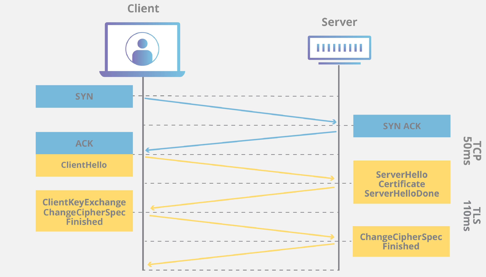
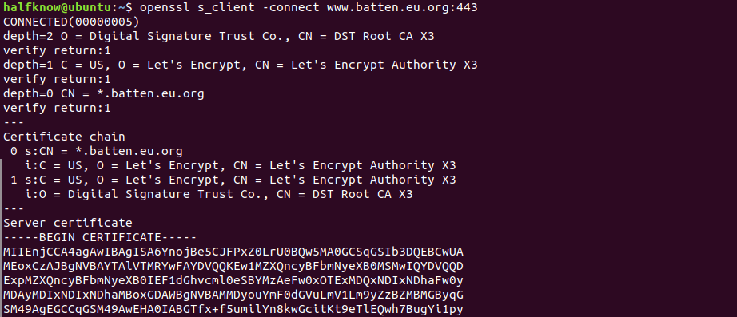
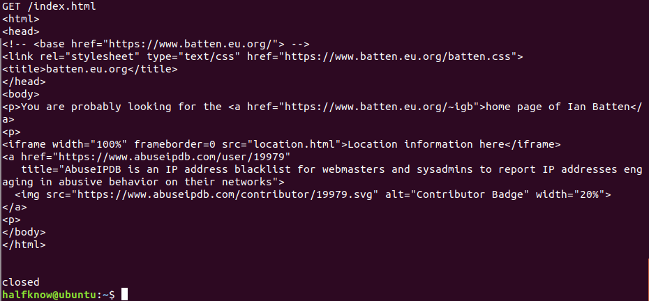

# Network Report

##### Student Name: Xiaoyu Xia

##### Student ID: 2057911

## Task 1

### Different sets of headers

#### Compare

- Encryption algorithms vary from websites to websites

> SSL connection using TLSv1.3 / TLS_AES_256_GCM_SHA384 - `From https://www.google.com`
>
> SSL connection using TLSv1.3 / TLS_AES_128_GCM_SHA256 - `From https://www.github.com`

- ALPN negotiates which protocol should be handled over a secure connection in a way that is more efficient and avoids additional round trips.

> ALPN, server accepted to use h2 - `From https://www.google.com`
>
> ALPN, server accepted to use http/1.1 - `From https://www.github.com`

- Return codes vary from sites to sites. If successful, it will return 200 while others will return 404, 301 like below, and etc.

> HTTP/2 200 - `From https://www.google.com`
>
> HTTP/1.1 301 Moved Permanently - `From https://www.github.com`

- Websites using various types of servers

> server: gws - `From https://www.google.com`
>
> server: nginx - `From https://www.batten.eu.org`
>
> server: Apache - `From https://www.cs.bham.ac.uk`

- Https connects to port 443 while http connects to port 80

> Connected to `www.google.com` (172.217.20.132) port 443 (#0) - `From https://www.google.com`
>
> Connected to `www.google.com` (172.217.169.36) port 80 (#0) - `From http://www.google.com`

Connections with https protocol also receive more messages started with \* in TLS including some information about TLS version, which http protocol accepted, detailed information about server certificate, connection state, and etc.

#### Contrast

- All links try to rebuild the original websites first like `https://www.google.com/` to get IP addresses `172.217.20.132` with help of DNS.

- The websites I try to access are all using `TCP_NODELAY` setting while this parameter has other value `TCP_QUICKACK`. After the message `TCP_NODELAY set`, it will shows `Connected to www.google.com (172.217.20.132) port 443 (#0)`, which means tcp connection has been established and we can send messages to server.

- The returned messages from servers are all including HTTP return code, request date, expire date, server type, contents of html, and etc.

### Http vs Https

First, using curl to request the websites in http version and https version, the webpages' addresses are same but transport in different protocols. Http connects to port 80 of the server and all the information are transported in plain text which will disclose some private information and lead to severe safety problems. While https based on both http and TLS that connects to port 443. That is why https returns more with the information encrypted in TLS:

> Specify which version of TLS (like TLS 1.3) will be use
>
> The Client and Server exchange hello messages to agree on algorithms, exchange random values, and check for session resumption.
>
> An exchange of the necessary cryptographic parameters allow the client and server to agree on a pre-master secret. (The pre-master secret is encrypted with the public key and can only be decrypted with the private key by the server.)
>
> A master secret is generated from the pre-master secret and exchanged random values.
>
> Security parameters are provided to the record layer.
>
> The Client and server verify that their peer has calculated the same security parameters and that the handshake took place without tampering by an attacker.

Both https and http protocols contain the course of TCP handshakes, the blue part of the above figure, in which all communications occur in plain text that is vulnerable to man in the middle attacks. However, the TLS handshakes that the yellow part encrypting the traffic are only owned by https protocol.

## Task 2

### Screen shot

After establishing a connection to the port 443 of `www.batten.eu.org`, TLS handshakes will process to discuss to use which encryption algorithms and verify server certificate. Waiting all the security verifications are done, we can use GET method to fetch pages in the connected websites.

## Task 3

### Brief Description

After request of `https://www.google.com` starting, new data in wireshark shows that standard querying of the IP address of google starts first with protocol DNS. Then IP address `172.217.20.132` is returned from `127.0.0.53` and TCP connection built later from the port 55244 of localhost to the port 443 of google server to have three TCP handshakes. After three TCP handshakes, TLS handshakes begin then client and server communicate to each other with respective messages: Client Hello (from server), Server Hello (from client), Change Cipher (from client first then from server), Application Data (from server) until the connection closed.

For 301 redirection, the wireshark cannot redirect the new address automatically, which will lead to the problem that testing the websites requiring to redirect once accessed will cost a lot of time to enter the new redirection address manually.

## Reference

[1] https://www.cloudflare.com/learning/ssl/what-happens-in-a-tls-handshake/

[2] https://ec.haxx.se/cmdline-urls.html

[3] https://www.keycdn.com/support/alpn
